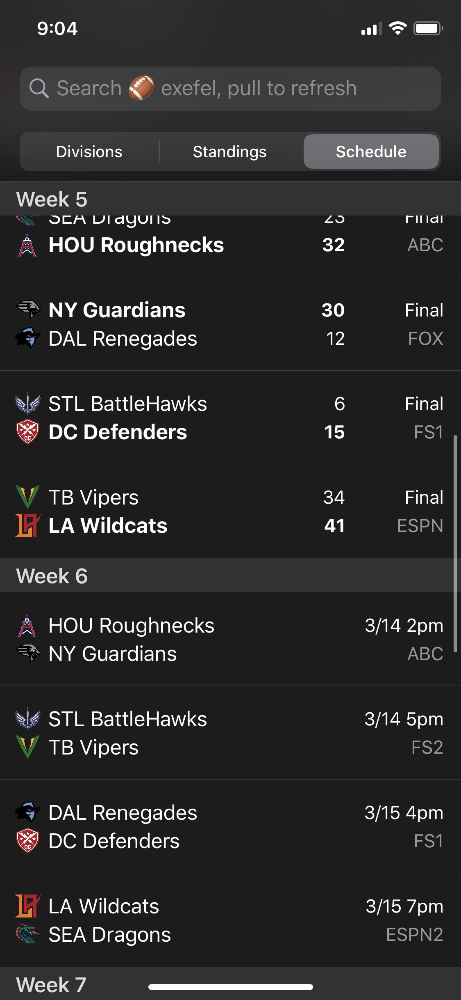
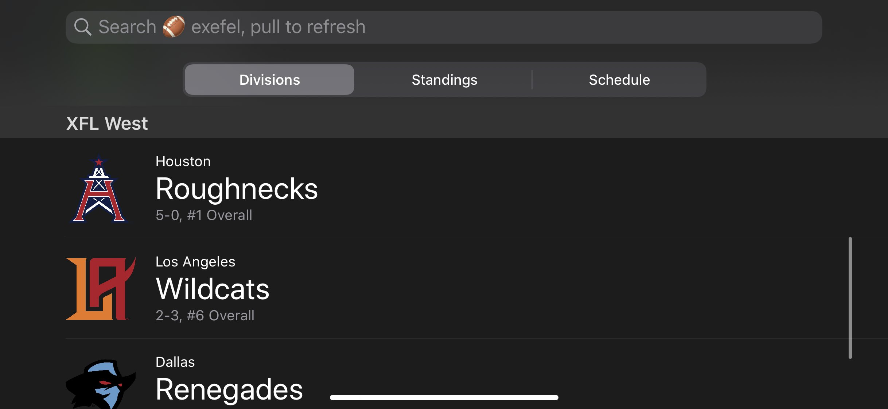

# exefel
🏈 unofficial xfl stats app for iOS




> [Demo on Twitter.](https://twitter.com/i/status/1238021430073270272)

## Usage

Swift app built with no libraries or dependencies. Scrapes and displays XFL data on-device for schedules and team information. Lived as long as the league did! 

## Authors

```
Julian Weiss
github.com/insanj
```

## [License](LICENSE)

```
GNU GENERAL PUBLIC LICENSE
Version 3, 29 June 2007
 ```

https://github.com/insanj/exefel/blob/master/LICENSE
